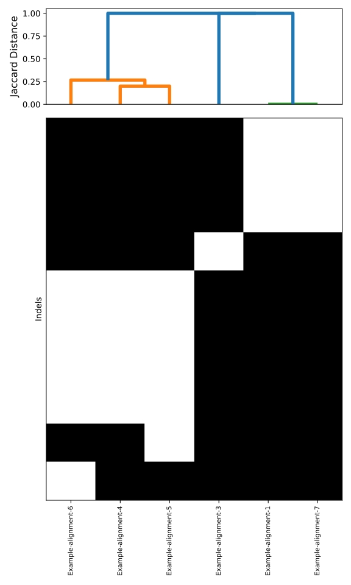

# About IDindel
IDindel is a collection of python3.10 scripts used to identify and compare indels in multiple sequences aligned with a common reference.

- **IDindel.py** - Creates a BED file listing indels positions and affected annotations from a fasta alignment<br>
- **IDindel-wrapper.py** - Wrapper that runs IDindel.py on a directory containing multiple fasta alignments<br>
- **MatrixBuilder.py** - Creates a presence/absence matrix from multiple BED files made by IDindel.py<br>
- **ClusterMaker.py** - Clusters sequences based on  the presence/absence indel matrix from MatrixBuilder.py<br>

## Required dependencies
The following Python libraries need to be installed to use IDindel:

- **numpy** v.2.2.6<br>
- **pandas** v.2.3.3<br>
- **scipy** v.1.15.3<br>
- **matplotlib** v.3.10.8<br>

You can use the ```requirements.txt``` file to install the correct version of each library.

## Required steps prior to launch
Before using IDindel, you must choose a reference sequence and align all sequences of interest with it. The reference must have an accompanying annotation file in GFF3 format. The chromosome name in the GFF3 file and the reference sequence name in the fasta file must be identical. Each sequence must be aligned individually with the chosen reference to produce alignments in fasta format and for consistency, the same sofware and parameters should be used for each alignment. You should have one alignment file per sequence you want to analyze. Also to limit potential errors, spaces and special characters should be avoided in the sequence names.

## Run IDindel on a single alignment
Running IDindel will return a BED file listing the indel positions and the annotated region it was found in. Indels occuring in unannotated regions will be tagged as intergenic. All overlapping annotations will be listed for a given indel. All positions and annotations will be based on the reference sequence found in the GFF3 file.

USAGE: ```python IDindel.py [-h] --fasta <FASTA file> --gff3 <GFF3 file> --out <BED output prefix>```

## Run IDindel on multiple alignment files
You can run IDindel on multiple alignment files with the same reference sequence using the IDindel-wrapper.py script. Place only and all your fasta alignments in a single directory before launching the script. When analyzing a large number of sequences, you can specify the optional ```--threads``` option to execute multiple analyses in parallel.

USAGE: ```python IDindel-wrapper.py [-h] --dir <input directory> --gff3 <GFF3 file> --out <output directory> --threads <number of threads>```

## Create a presence/absence matrix of indels using MatrixBuilder.py
Using a directory containing multiple BED files using the same reference sequence generated by IDindel.py you can generate a presence/absence matrix in csv format with the _PA_matrix.csv suffix. The ```--start_pos``` and ```--end_pos``` options allow the exclusion of regions at the beginning or the end of the reference sequence in the analysis. In the matrix, lines will correspond to the sequence names and the columns to the indels observed in the BED files. Sequences without any indels will be excluded from the presence/absence Matrix but will be listed in other files. The ```<prefix>_no_Indels.txt``` file will list sequences without any indels compared to the reference sequence. The ```<prefix>_Out-of-bounds-indels.txt``` will list sequences with indels that are located only in the regions excluded by ```--start_pos``` and ```--end_pos```.

USAGE: ```python MatrixBuilder.py [-h] --input <input directory> --prefix <output prefix> [--start_pos <INTEGER> --end_pos <INTEGER>]```

## Create sequence clusters and dendrogram using ClusterMaker.py
Using the presence/absence matrix generated with MatrixBuilder.py, you can generate sequence clusters based on their indels. The clustering method uses the Jaccard distance between the set of indels of each sequence. The script also produces a dendrogram representation of the clusters as well as a map of the indel events observed in the sequences. By default, the script will attribute random consecutive numbers as cluster IDs, but you can provide an optional csv file via the ```--cluster``` option to attribute specific cluster names to specific sequences. This option is useful when using sequences as anchors during the clustering or flagging sequence of particular interest. This csv file should have the format : ```sequence_name,Cluster_name```. In the event that sequences in this csv are clustering together, the final cluster name will be a combination of the names separated by underscores.

The dendrogram and indel map visuals can be customized using the following optional flags:

```
  -fs, --figsize integer  Optional, figure size, default:100
  -dw, --dlwidth integer  Optional, dendrogram line width, default:4
  -df, --dfont integer  Optional, dendrogram font size, default:12
  -mf, --mfont integer  Optional, matrix font size, default:8
```

USAGE: ```python ClusterMaker.py [-h] --matrix <presence/absence matrix> --prefix <output prefix> [--threshold <integer>] [--cluster <csv file to set clusters>] [--figsize <integer>] [--dlwidth <integer>] [--dfont <integer>] [--mfont <integer>]```

## Example run

Using the data from the Example folder you can run the following commands from within :

```
  python ../IDindel-wrapper.py -d Alignments -g Example.gff3 -o Indel-Annotations

  python ../MatrixBuilder.py -i Indel-Annotations -p Example-run -s 190 -e 15260

  python ../ClusterMaker.py -m Example-run_PA_matrix.csv -p Example_fig
```

You should obtain a final ```Example_fig.svg``` figure similar to this one:



and an ```Example_fig.csv``` looking like this:

```
Sequence,Cluster
Example-alignment-1,2
Example-alignment-7,2
Example-alignment-3,3
Example-alignment-4,1
Example-alignment-5,1
Example-alignment-6,1
```

The branches may be placed in a different order or the cluster numbers may be different, but the same sequences should cluster together. Eagle-eyed viewers will notice the absence of the Example-alignment-2 sequence, as this sequence has no indel when compared to the reference it has been excluded from the dendrogram and the cluster file, but is listed in the ```Example-run_no-Indels.txt``` file.


## Citation

Baby V, Koszegi M, Osemeke OH, Provost C and Gagnon CA, (2026), Whole genome classification system for porcine reproductive and respiratory syndrome virus type 2 (Betaarterivirus americense) strains combining ORF5, nsp3-4-5 and Indels, (under review)

Alignments, reference sequence and indel groups from the paper are available in the Data_from_baby_et_al_2026 directory.

## Disclaimer
This code was generated with the assistance of an AI tool (e.g., Microsoft Copilot).
Please review and test thoroughly before using in production.
